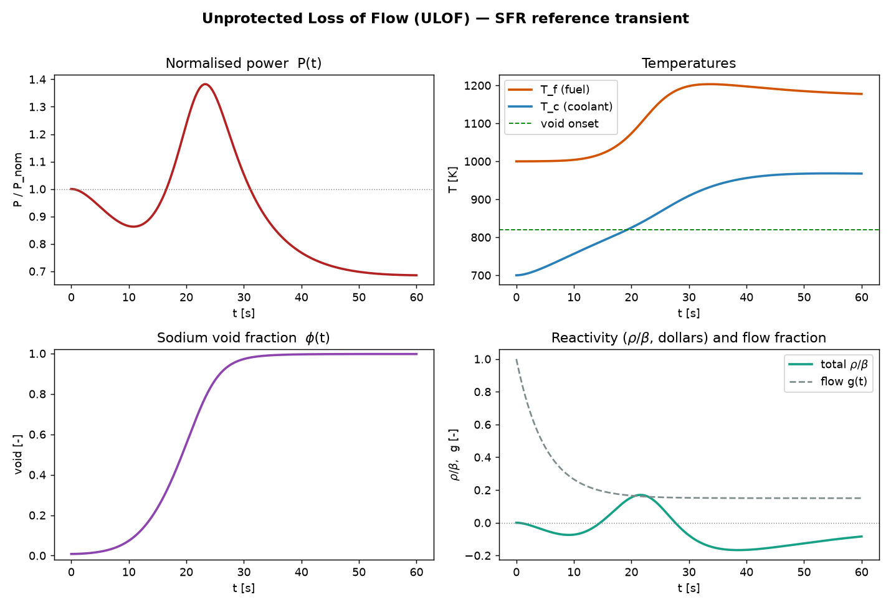

# pinn-sfr-transient

Physics-Informed Neural Network for the **Unprotected Loss of Flow (ULOF)**
transient in a Generation-IV **Sodium-cooled Fast Reactor (SFR)**: 6-group point
kinetics coupled to a lumped two-node thermal-hydraulics core, closed by
reactivity feedback including the safety-defining **positive sodium void
coefficient**. No experimental data is used for training — the physics residuals
are the teacher; a stiff `scipy` integrator is the held-out reference.



> Loss of flow drives the coolant past the void-onset temperature; the positive
> void coefficient pushes power to **1.38× nominal at ≈ 23 s**, then negative
> Doppler feedback dominates and the power turns over, settling to ≈ 0.69× — a
> bounded, self-limiting transient.

This README is a map. The physics, the neural-network methodology, and the usage
details live in [`docs/`](docs/) — see [Documentation](#documentation) below.

## Quick start

```bash
uv sync                      # create .venv from pyproject + lockfile
uv run pinn-sfr reference    # stiff reference sim -> results/ulof_reference.npz (held-out data)
uv run pinn-sfr figures      # (re)generate every README/docs figure -> docs/img/
uv run pytest                # consistency tests (numpy/scipy only)
```

The PINN has **two equally first-class backends** — PyTorch and JAX — solving the
same residuals (compared in [`docs/neural_network.md`](docs/neural_network.md) §9).
Each is an optional extra with a CPU build (small, recommended) and a CUDA build
(`-gpu`). Both train on the *same* optimisation budget and fit comparably; a GPU
speeds them up ~5× on a Colab T4 (about a minute, vs several on CPU — varies by
instance):

```bash
uv sync --extra torch-cpu  && uv run python -m pinn_sfr_transient.pinn_torch    # PyTorch
uv sync --extra jax-cpu    && uv run python -m pinn_sfr_transient.pinn_jax      # JAX (Equinox+Optax)
uv sync --extra deepxde --extra torch-cpu && uv run python -m pinn_sfr_transient.pinn_deepxde
# CUDA: swap any `-cpu` extra for `-gpu`. With torch present, `pinn-sfr figures`
# also renders the PINN overlay.
```

**No GPU required** — the reference solver, tests and the small float64 PINN are
all comfortable on a CPU. See [`docs/usage.md`](docs/usage.md) for the full CLI,
library API, compute notes and troubleshooting.

## Documentation

The heavy lifting is in the docs and notebooks:

- [`docs/physics_theory.md`](docs/physics_theory.md) — point kinetics, lumped
  thermal-hydraulics, reactivity feedback (Doppler + positive sodium void), the
  ULOF transient, non-dimensionalisation, parameters, and validity caveats.
- [`docs/neural_network.md`](docs/neural_network.md) — PINN methodology: the
  normalized-state formulation, hard-IC ansatz, architecture, Adam→L-BFGS
  training, the adaptive recipe (causal weighting, gradient-norm loss weights,
  residual-adaptive sampling, forward-mode autodiff), **and a JAX-vs-PyTorch
  comparison** (§9) of the two backends.
- [`docs/usage.md`](docs/usage.md) — install, run, train, use as a library,
  compute requirements, troubleshooting.
- [`docs/references.md`](docs/references.md) — annotated bibliography
  ([`docs/references.bib`](docs/references.bib) for LaTeX).
- [`notebooks/01_ulof_walkthrough.ipynb`](notebooks/01_ulof_walkthrough.ipynb) —
  interactive end-to-end walkthrough (reference sim, plots, residual check, short
  PINN demo).
- [`notebooks/02_safety_map.ipynb`](notebooks/02_safety_map.ipynb) —
  parameter-space safety study (peak-power map, phase portraits; numpy/scipy
  only).

## Layout

```
pinn-sfr-transient/
├── src/pinn_sfr_transient/
│   ├── config.py      # SFRParams (typed; derived steady state)
│   ├── physics.py     # reactivity, void, flow, RHS (numpy)
│   ├── reference.py   # stiff Radau solver -> Trajectory
│   ├── pinn_jax.py    # JAX PINN (functional; Equinox + Optax; fast on GPU)
│   ├── pinn_torch.py  # PyTorch PINN (OO/eager; same recipe + RAR)
│   ├── pinn_deepxde.py# DeepXDE variant (same residuals)
│   ├── plotting.py    # 4-panel reference figure
│   ├── figures.py     # regenerates every docs/img/ figure from the model
│   └── cli.py         # `pinn-sfr` entry point (reference, figures)
├── tests/             # pytest: consistency, physics, CLI (+ PINN when torch present)
├── docs/              # theory, usage, references; img/ holds ALL committed figures
├── notebooks/         # guided walkthroughs (outputs stripped; run to reproduce)
└── results/           # held-out reference .npz from `pinn-sfr reference` (gitignored)
```

Tooling: **uv** (project + envs), **ruff** (lint + format), **ty** (type check),
**pre-commit** (local quality gate), **pytest**, and a small GitHub Actions
workflow ([`.github/workflows/test.yml`](.github/workflows/test.yml)) running the
suite + an 85% coverage gate on the CPU torch backend, plus a core-only job.
`src/` layout, fully type-hinted, PEP 561 (`py.typed`).

## License

[Blue Oak Model License 1.0.0](LICENSE) (SPDX: `BlueOak-1.0.0`).
