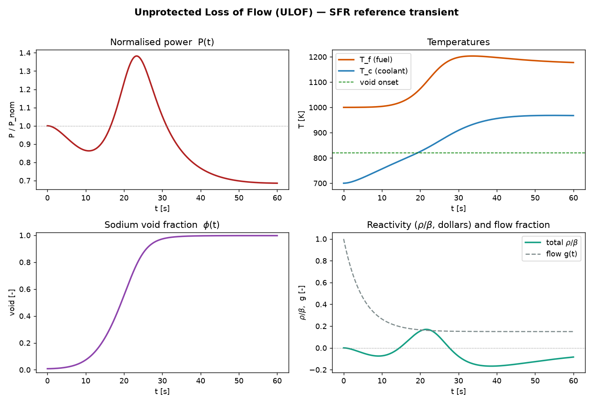
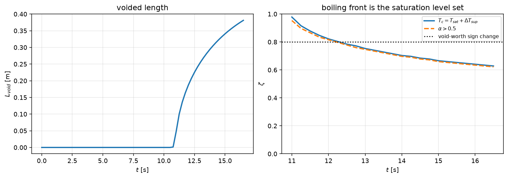

# pinn-sfr-transient

Physics-Informed Neural Networks for the **Unprotected Loss of Flow (ULOF)**
transient in a Generation-IV **Sodium-cooled Fast Reactor (SFR)**. No experimental
data is used for training — the physics residuals are the teacher; a stiff `scipy`
integrator is the held-out reference.

The repository holds **two models**, and they are at very different stages:

| | [0D lumped](docs/physics_theory.md) | [1D axial boiling](docs/axial_physics.md) |
|---|---|---|
| state | 6-group point kinetics + two thermal nodes | four material fields on an axial mesh + sodium void |
| void | a `tanh` demonstration surrogate at 820 K | saturation + superheat from the SAS4A manual, ~1156 K |
| reference solver | verified | verified, except the void fraction (`axial_physics.md` §6.5) |
| PINN | **meets its bar** — a few 1e-3 relative L2 | **does not meet its bar** — see below |
| backends | PyTorch, JAX, DeepXDE | PyTorch, JAX |

This README is a map. The physics, the neural-network methodology, and the usage
details live in [`docs/`](docs/) — see [Documentation](#documentation).

## The 0D model — a solved problem



Loss of flow drives the coolant past the void-onset temperature; the positive
void coefficient pushes power to **1.38× nominal at ≈ 23 s**, then negative
Doppler feedback dominates and the power turns over, settling to ≈ 0.69× — a
bounded, self-limiting transient. Trained on residuals alone, the PINN recovers
the whole trajectory ([`docs/neural_network.md`](docs/neural_network.md) §7).

## The 1D axial model — the current work



Because the 0D void surrogate cannot say *where* boiling starts, how far the void
spreads, or that the sodium void worth **changes sign** near the top of the core —
which is what a loss-of-flow safety argument turns on — a second model resolves the
channel axially and takes its thermophysics, boiling onset and feedback laws from the
[SAS4A/SASSYS-1 manual](https://sas-doc.nse.anl.gov/latest/) (ANL/NSE-SAS/5.8.1).

**Status, stated plainly.** The reference solver is verified and the physics
question is answered: the positive sodium void coefficient **does** drive a power
excursion, to 5.3× nominal, governed by the height at which the void worth changes
sign rather than by its magnitude ([`docs/axial_physics.md`](docs/axial_physics.md)
§10).

The PINN trains, satisfies every hard constraint exactly, and **does not meet its
1% accuracy bar** — 0.028 relative L2 on `T_s` at the shipped defaults, 0.022 at the
documented best. The reference's own error is 1.1–1.6e-3, so the bar sits 6–9× above
the ruler and the failure is the network's.

The boiling front forms on every seed of both backends, and it forms by clearing
saturation by 24 K out of a 590 K range — a margin, not a mechanism, which is why
it was fragile for so long. **The previous default cleared it by −2.3 K and
therefore formed no front at all**, on any seed of either backend, while the
documentation said otherwise. Both the horizon and the budget that caused that are
fixed and pinned by tests.

**What the current round is measuring.** Two things are in flight and neither has
its third seed yet, so neither has moved a number above. A 54-run sweep of Adam
against quasi-Newton iterations finds the **quasi-Newton budget is the axis that
forms the front** — the Adam axis is flat over two decades once it is funded, which
is awkward, because the Adam count is what the shipped default was tuned on
([`docs/axial_nn.md`](docs/axial_nn.md) §7.5.11). And three ways of aiming capacity
at the front are being swept one knob at a time; one of them reproduced the
reference's peak saturation margin to 0.1 K on a single seed (§7.5.12–§7.5.14).

[`docs/axial_nn.md`](docs/axial_nn.md) **§0 is the status quo** — accuracy, what is
settled, what is open, and **§0.6 says which configuration to use**. §5–§7 carry
every measurement, including the negative results, which outnumber the positive
ones, and including which of that document's own conclusions have been retracted —
ten so far, seven during the study that produced §0 and three more since.

**Every deviation from the manual is registered** in
[`docs/axial_physics.md`](docs/axial_physics.md) §3 with its equation number. That
register is a contract, not a commentary: an unregistered deviation is a bug, and
new physics lands **off by default** so no published number moves when it does.

## Quick start

```bash
uv sync                             # create .venv from pyproject + lockfile
uv run pinn-sfr reference           # 0D stiff reference -> results/ (held-out data)
uv run pinn-sfr figures             # (re)generate the 0D figures -> docs/img/
uv run pinn-sfr axial reference     # 1D axial channel, prescribed power
uv run pinn-sfr axial reference --feedback   # ... with the prompt-jump kinetics closed
uv run pinn-sfr axial figures       # -> docs/img/axial_*.png
uv run pytest                       # the suite; backend tests skip without their extra
```

Both models are solved by **two equally first-class PINN backends** — PyTorch and
JAX — on the same residuals. Each is an optional extra:

```bash
uv sync --extra torch-cpu  && uv run python -m pinn_sfr_transient.axial.pinn_torch
uv sync --extra jax-cpu    && uv run python -m pinn_sfr_transient.axial.pinn_jax
uv sync --extra deepxde --extra torch-cpu && uv run python -m pinn_sfr_transient.pinn_deepxde
```

**CPU is the target.** These are small float64 networks; float64 is throttled to
roughly 1/32–1/64 of FP32 on consumer NVIDIA hardware, which is most of the reason a
GPU does not pay for itself here. CUDA builds exist (swap any `-cpu` extra for
`-gpu`) but are neither required nor benchmarked on the axial model. Google Colab is
**not** a target: the axial PINN needs tens of minutes of CPU per run. Pin
`OMP_NUM_THREADS` before quoting any timing or any reproducibility claim — thread
count changes float reduction order.

## Documentation

- [`docs/physics_theory.md`](docs/physics_theory.md) — the 0D model: point
  kinetics, lumped thermal-hydraulics, reactivity feedback (Doppler + positive
  sodium void), the ULOF transient, non-dimensionalisation, parameters, caveats.
- [`docs/neural_network.md`](docs/neural_network.md) — the 0D PINN: normalized-state
  formulation, hard-IC ansatz, architecture, Adam→L-BFGS training, the adaptive
  recipe (causal weighting, gradient-norm loss weights, residual-adaptive sampling,
  forward-mode autodiff), and a JAX-vs-PyTorch comparison (§9).
- [`docs/axial_physics.md`](docs/axial_physics.md) — the 1D model: four material
  fields, real sodium properties, saturation-plus-superheat boiling onset, film
  dryout, the prompt-jump kinetics closure, and **the deviation register**.
- [`docs/axial_nn.md`](docs/axial_nn.md) — the 1D PINN: ansatz, hard constraints,
  training recipe, both backends, and every measured result.
- [`docs/sas4a/`](docs/sas4a/) — a local text mirror of the SAS4A/SASSYS-1 manual,
  so an equation citation can be checked without a network round-trip. Fetched by
  [`tools/fetch_sas_manual.py`](tools/fetch_sas_manual.py).
- [`tools/axial_study.py`](tools/axial_study.py) — one sub-command per published
  axial study (`ruler`, `horizon`, `budget`, `optimizer`, `parity`, `plan-a`,
  `combo`, `regime`, `regime-sign`). Every table in `axial_nn.md` and
  `axial_physics.md` §10 is reproducible by one of them. This exists because it
  once did not: a published configuration differed from the shipped default and
  nobody could tell, since the measurement lived in an uncommitted scratch file.
- [`docs/usage.md`](docs/usage.md) — install, run, train, use as a library, compute
  requirements, troubleshooting.
- [`docs/references.md`](docs/references.md) — annotated bibliography
  ([`docs/references.bib`](docs/references.bib) for LaTeX).
- [`notebooks/01_ulof_walkthrough.ipynb`](notebooks/01_ulof_walkthrough.ipynb) —
  interactive end-to-end walkthrough of the 0D model.
- [`notebooks/02_safety_map.ipynb`](notebooks/02_safety_map.ipynb) —
  parameter-space safety study (peak-power map, phase portraits; numpy/scipy only).

## Layout

```
pinn-sfr-transient/
├── src/pinn_sfr_transient/
│   ├── config.py        # SFRParams (typed; derived steady state)
│   ├── physics.py       # reactivity, void, flow, RHS (numpy)
│   ├── reference.py     # stiff Radau solver -> Trajectory
│   ├── pinn_torch.py    # 0D PyTorch PINN (OO/eager; recipe + RAR)
│   ├── pinn_jax.py      # 0D JAX PINN (functional; Equinox + Optax)
│   ├── pinn_deepxde.py  # 0D DeepXDE variant (same residuals, vanilla loop)
│   ├── plotting.py      # 4-panel reference figure
│   ├── figures.py       # regenerates the 0D docs/img/ figures
│   ├── cli.py           # `pinn-sfr` (reference | figures | axial …)
│   └── axial/
│       ├── config.py    # AxialParams (mesh, geometry, feedback switches)
│       ├── sodium.py    # the §12.13 sodium property correlations
│       ├── physics.py   # the residuals — ONE definition, shared by all three
│       ├── reference.py # stiff axial solver -> AxialTrajectory
│       ├── figures.py   # regenerates the axial docs/img/ figures
│       ├── torchpinn/   # PyTorch backend, split config/archs/ansatz/model/
│       │                #   weighting/training/evaluate
│       ├── jaxpinn/     # JAX backend, the same split plus residuals/samplers
│       ├── pinn_torch.py# facade re-exporting torchpinn's public surface
│       └── pinn_jax.py  # facade re-exporting jaxpinn's public surface
├── tests/               # pytest: consistency, physics, CLI, both PINNs, parity
├── docs/                # theory, usage, references; img/ holds ALL figures;
│                        #   sas4a/ mirrors the manual
├── tools/               # axial_study.py       — every published axial table, one
│                        #   sub-command per study, because a number is reproducible
│                        #   when its configuration is in the repository
│                        # check_published_accuracy.py — the 0D claim, from defaults
│                        # check_markdown.py    — the AGENTS.md rendering rules
│                        # fetch_sas_manual.py  — mirrors the SAS4A manual
├── notebooks/           # guided walkthroughs (outputs stripped; run to reproduce)
└── results/             # held-out reference .npz files (gitignored)
```

The axial backends are **packages, not modules**, split after
[jaxpi2](https://github.com/sifanexisted/jaxpi2) so that an ablation is a config
change rather than an edit to one long file — and so that `evaluate` never being
imported by `training` makes "the reference never enters the loss" a structural
property instead of a convention. They expose the same knobs with the same
defaults, asserted field by field by a test, because that has silently broken twice
([`docs/axial_nn.md`](docs/axial_nn.md) §4).

Tooling: **uv** (project + envs), **ruff** (lint + format, `select = ["ALL"]`),
**ty** (type check), **pre-commit** (local quality gate), **pytest**, and a GitHub
Actions workflow ([`.github/workflows/test.yml`](.github/workflows/test.yml)) with
three jobs: the CPU torch backend on Python 3.14 with an 85% coverage gate, the JAX
backend on 3.13, and a core-only job on 3.13 that proves the optional-import guards
hold. `src/` layout, fully type-hinted, PEP 561 (`py.typed`).

## License

[Blue Oak Model License 1.0.0](LICENSE) (SPDX: `BlueOak-1.0.0`).
