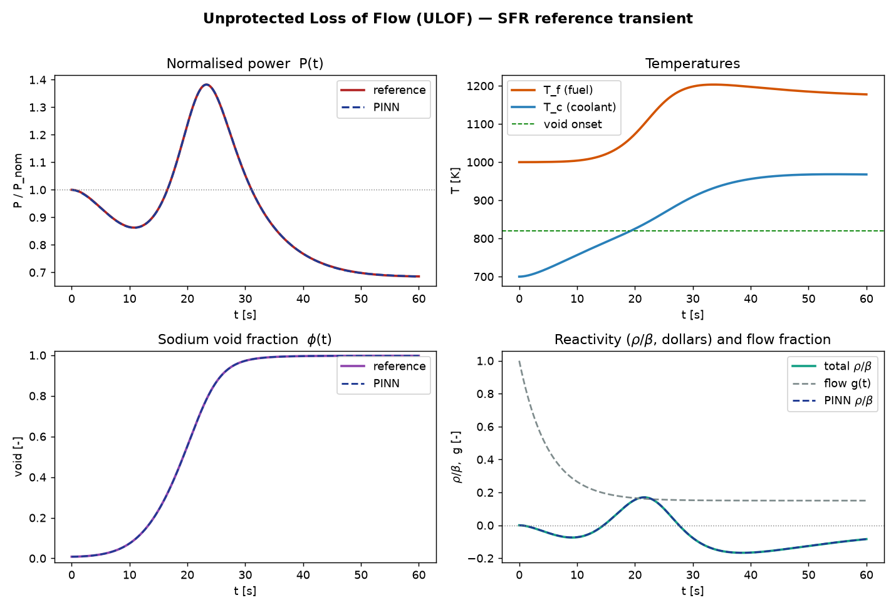

# Neural network & PINN methodology

This document describes the deep-learning side of `pinn-sfr-transient`: the
physics-informed neural network (PINN) that solves the coupled ULOF system from
`docs/physics_theory.md` using *only* the physics residuals as supervision (no
training data). Citations refer to `docs/references.md`.

Implementations: `src/pinn_sfr_transient/pinn_torch.py` (from-scratch PyTorch) and
`src/pinn_sfr_transient/pinn_jax.py` (from-scratch JAX / Equinox + Optax) — two
equally first-class backends — plus `src/pinn_sfr_transient/pinn_deepxde.py`
(DeepXDE). Target stack: **PyTorch ≥ 2.12** / **JAX ≥ 0.4** on Python 3.12+.

---

## 1. What a PINN is

A PINN represents the solution of a differential system by a neural network
$\mathcal{N}_\theta(t)$ and trains $\theta$ to minimise the residual of the
governing equations, evaluated by automatic differentiation at a set of
*collocation* points [Raissi, Perdikaris & Karniadakis 2019]. There is no need
for labelled solution data: the equations are the teacher. This is ideal here,
because experimental ULOF data for SFRs is confidential or unavailable, so the
project reserves the high-accuracy numerical reference purely for **test-time**
validation.

For an ODE system $\dot{\mathbf y} = \mathbf f(t,\mathbf y)$, the physics loss is

```math
\mathcal{L}(\theta) = \frac{1}{N}\sum_{n=1}^{N}
\big\| \dot{\mathbf y}_\theta(t_n) - \mathbf f\big(t_n,\mathbf y_\theta(t_n)\big) \big\|_w^2,
```

where $\dot{\mathbf y}_\theta$ comes from `torch.autograd.grad` and
$\|\cdot\|_w$ is a per-equation weighting.

---

## 2. Why naive PINNs fail here — and the fix

The raw PKE are pathologically stiff ($\Lambda\sim5\times10^{-7}$ s, precursors
$\sim10^4\text{ to }10^5$). A network regressing the raw states cannot balance a loss
whose terms span $\sim10^8$ in magnitude — the documented stiff "failure mode"
of PINNs [Ji et al. 2021; Krishnapriyan et al. 2021; Wang, Teng & Perdikaris
2021]. The remedy adopted here is **comprehensive non-dimensionalisation of
states *and* equations**, following the ODE-PINN recipe of
[Cuong et al. 2024] and the variable-scaling idea of VS-PINN
[Ko & Park 2024].

The network outputs the $O(1)$ normalised states $p, c_i, \theta_f, \theta_c$
(defined in `docs/physics_theory.md` §5.2). In these variables the precursor
equations collapse to $\dot c_i = \lambda_i(p-c_i)$ and the power residual is
rescaled to $O(\beta)$:

```math
\begin{aligned}
R_p   &= \Lambda\,\dot p - \big[(\rho-\beta)\,p + \textstyle\sum_i\beta_i c_i\big],\\
R_{c_i} &= \dot c_i - \lambda_i\,(p - c_i),\\
R_{\theta_f} &= \Delta T_f\,\dot\theta_f - \big[\tfrac{P_0}{C_f}P - \tfrac{UA}{C_f}(T_f-T_c)\big],\\
R_{\theta_c} &= \Delta T_c\,\dot\theta_c - \big[\tfrac{UA}{C_c}(T_f-T_c) - \tfrac{W_0 g}{C_c}(T_c-T_{in})\big].
\end{aligned}
```

All four residual blocks are now $O(1)$-balanced and the loss is trainable.
`tests/test_consistency.py` verifies these equal the physical ODEs to machine
precision ($|R_p|\sim2\times10^{-10}$ on the reference trajectory).

---

## 3. Network and ansatz

### 3.1 Architecture

A plain multilayer perceptron, input $t$ → output $\in\mathbb{R}^9$:

* `1 → 64 → 64 → 64 → 64 → 64 → 9`, `tanh` activations, uniform init
  ($\mathcal{U}(\pm 1/\sqrt{n_{\mathrm{in}}})$, fan-in $n_{\mathrm{in}}$, on
  weights *and* biases, matching both backends — see §9).
* `tanh` is the standard PINN activation: smooth and infinitely differentiable,
  so the autograd-computed derivatives are well-behaved.
* Time is normalised to $\hat t = t/t_{\text{end}}\in[0,1]$ before entering the
  network (input scaling).

### 3.2 Hard initial conditions

Rather than penalising the IC softly, the network output is wrapped so the
nominal steady state is satisfied **exactly** for all $\theta$:

```math
\mathbf s(t) = \mathbf s_0 + \hat t\,\mathcal{N}_\theta(\hat t),
```

with $\mathbf s_0=[1,\dots,1]$ (nominal in normalised coordinates). At $t=0$,
$\hat t=0$ so $\mathbf s(0)=\mathbf s_0$ identically. This removes the IC term
from the loss — leaving a pure-physics objective — and is a standard
hard-constraint trick that improves conditioning [Lu et al. 2021 (DeepXDE)].

---

## 4. Training

The schedule below is **identical in both backends**. The code references name the
PyTorch `Trainer`; the JAX backend (`pinn_jax.py`) mirrors each step with the
equivalent free functions (`causal_loss`, `_block_grad_norms`, `_rar_points`).

### 4.1 Two-stage optimisation

1. **Adam** (lr $10^{-3}$, cosine-decayed to $10^{-4}$) for ~15k iterations —
   robust global exploration of the loss landscape.
2. **L-BFGS** with strong-Wolfe line search — a quasi-Newton polish that drives
   the residuals down by several more orders of magnitude on a fixed
   collocation set. The Adam→L-BFGS schedule is the de-facto standard for PINNs.

See §4.5 for why the schedule is cosine (not step or warmup-stable-decay), why the
L-BFGS polish always helps, and an optional higher-accuracy optimiser.

### 4.2 Collocation sampling (with adaptive refinement)

Points are drawn uniformly on $[0,t_{\text{end}}]$ with an extra cluster on the
first 40% of the horizon (fastest dynamics), plus a **residual-based adaptive
refinement (RAR)** reservoir [Wu et al. 2023]: every `rar_every` iterations a
large candidate pool is scored and the highest-residual points are appended to
the collocation set (`Trainer.rar_refine`). This concentrates effort on the
void-onset front as it emerges.

### 4.3 Loss weighting (implemented)

Two complementary adaptive schemes are active by default:

* **Gradient-norm adaptive block weights** [Wang, Teng & Perdikaris 2021]:
  every `weight_update_every` iterations the gradient norm of each of the four
  residual blocks (power, precursors, fuel, coolant) is measured and the block
  weights $\lambda_k$ are nudged (EMA) toward $\bar g/g_k$, so no block dominates
  the gradient (`Trainer.update_block_weights`).
* **Causal temporal weighting** [Wang, Sankaran & Perdikaris 2024]: the horizon
  is split into time chunks; chunk $m$ is weighted by
  $w_m=\exp(-\varepsilon\sum_{k<m}\mathcal L_k)$ (weights detached), so the
  network must reduce the residual at earlier times before later ones count
  (`Trainer.causal_loss`). This respects the arrow of time across the moving
  boiling front.

Further options from the literature (NTK balancing [Wang, Yu & Perdikaris 2022],
SA-PINN point weights [McClenny & Braga-Neto 2023]) slot into the same hooks.

### 4.4 Automatic differentiation (forward-mode by default)

The time derivative $\partial\mathbf s/\partial t$ is computed in a **single
fused forward-mode pass** using `jvp` + `vmap` — `torch.func.jvp` in PyTorch
(`SFRPinn._deriv_forward`) and `jax.jvp` in JAX (`SFRPinn.state_and_deriv`): for a
scalar-input/vector-output map this returns the entire 9-component derivative at
once, far cheaper than nine reverse-mode passes. The PyTorch backend additionally
retains a reverse-mode path (`_deriv_reverse`), used automatically as a fallback if
the `torch.func` composition misbehaves on a given build. Both run in **float64** —
essential at these residual magnitudes.

### 4.5 Optimiser and schedule (measured choices)

Three settings here were fixed by experiment, not by default:

* **Cosine-decayed Adam, no warmup.** The rate anneals $10^{-3}$ to $10^{-4}$ across the
  Adam phase, and the decay is essential: this transient is stiff, so a *constant* rate
  floors the power error near $3\times10^{-2}$ (or diverges if raised), whereas annealing
  reaches the $\sim10^{-3}$ basin. Learning-rate warmup and a warmup-stable-decay
  schedule were both tried and are worse here — the gradient-norm block weights start
  small, so early training is already well-conditioned and warmup only wastes steps.
* **The L-BFGS polish is always a net gain.** Across budgets and both backends it cuts
  the power relative $L_2$ error by roughly 1.7–6×, with training loss and
  trajectory error falling together (genuine accuracy, not collocation overfitting). The
  PyTorch polish keeps a divergence guard that restores the Adam result on the rare bad
  line-search step, so it can only help.
* **Production hint — AdEMAMix.** For high-budget runs (≳8000 Adam iterations),
  swapping Adam for AdEMAMix [Pagliardini, Ablin & Grangier 2024] under the *same* cosine
  schedule lowers the power error a further ~1.6–2× (measured across
  seeds on JAX; the gain survives the L-BFGS polish). Below ~5000 iterations its
  slow EMA has not warmed up and it is unstable, so the shipped default — and the
  notebook's short runs — keep plain Adam.
* **No lucky-seed effect.** At the notebook budget (3000 Adam + 600 L-BFGS) every
  seed converges into the same sub-1% basin: across seeds 0–4 the power relative
  $L_2$ error stays in roughly $1\text{ to }4\times10^{-3}$ on *both* backends
  (medians $\sim1.4\times10^{-3}$ torch, $\sim1.7\times10^{-3}$ JAX), with no run
  diverging or failing. The run-to-run spread (≤4×) is smaller than the L-BFGS gain
  above, so the recipe — not the random draw — sets the accuracy, and the two
  backends are statistically indistinguishable.

---

## 5. PyTorch implementation notes

The implementation uses current PyTorch idioms:

* **`torch.func.jvp` + `vmap`** — used by default for the forward-mode Jacobian
  (§4.4); the modern, vectorised way to differentiate a scalar→vector map.
* **`torch.compile`** — opt-in via `TrainConfig(compile=True)`; graph capture +
  kernel fusion for the dense MLP. Off by default because `compile` can interact
  awkwardly with `func` transforms on some builds.
* **`torch.float64`** throughout — required for this stiff problem.
* **device-agnostic** — `TrainConfig(device=...)` selects CPU / CUDA / MPS.

The training algorithm itself (causal weighting, adaptive weights, RAR) lives in
the `Trainer` class so it is easy to audit and extend.

---

## 6. Three implementation paths

| | `pinn_torch.py` | `pinn_jax.py` | `pinn_deepxde.py` |
|---|---|---|---|
| Paradigm | object-oriented, eager | functional | framework-driven |
| Stack | `torch`, `torch.func` | Equinox + Optax | DeepXDE (+ torch backend) |
| Recipe | full (causal, RAR, grad-norm wts) | full (same) | **vanilla PINN — none of these** |
| Residuals | identical normalised form | identical normalised form | identical normalised form |
| Accuracy here | **~1e-3** (P) | **~1e-3** (P) | **~0.3** (P) — under-fits |
| Status | first-class | first-class | baseline only, not recommended here |

The two from-scratch backends are the recommended path. **DeepXDE is a baseline,
not a reference to emulate:** it solves the *same* residuals, but solving the
residuals is not the same as solving the problem. Its vanilla training loop has no
causal weighting, RAR, or gradient-norm balancing (§4), so on this stiff,
moving-front transient it drives the residual to ~1e-6 yet still mis-fits the power
by **~28 %** — a textbook instance of §2's failure mode. It is kept only to show
the same physics expressed in a high-level library (and *why* the recipe matters),
not as a solver to rely on here. §9 compares the two from-scratch backends
(PyTorch and JAX).

---

## 7. Validation protocol

The network never sees solution data during training. After training,
`relative_l2()` compares the PINN against the held-out
Radau reference trajectory (`results/ulof_reference.npz`) in the relative
$L_2$ norm for $P$, $T_f$, $T_c$. The reference is the only "data", and it is
used strictly for this final error metric — never in the loss.

Trained on the physics residuals alone — no reference data — the network recovers
the full transient: the dashed PINN curves below sit on top of the reference in
every panel, including the sodium void fraction and net reactivity, which are
*derived* from the PINN's predicted temperatures rather than fit directly:



This overlay is produced by `uv run pinn-sfr figures` (with the `torch-cpu`
extra), which trains the PINN with the adaptive recipe above and writes
`docs/img/pinn_overlay.png` — so the fit can be inspected visually alongside the
$L_2$ metric.

---

## 8. Extensions

Implemented already: causal weighting, gradient-norm adaptive weights, RAR
sampling, forward-mode AD (§4). Natural extensions:

* **Parametric / operator learning**: a DeepONet [Lu et al. 2021] or Fourier
  Neural Operator [Li et al. 2021; Wen et al. 2022] over the ULOF scenario
  family $(\tau_{\text{pump}},\alpha_{\text{void}},\dots)$ — where a learned
  surrogate finally beats re-running the ODE solver.
* **Differentiable-solver hybrid**: embed a conservation-respecting integrator
  inside the loss.
* **Stiff transfer learning** [Seiler et al. 2025] for fast re-solves across
  parameter perturbations.

---

## 9. PyTorch vs JAX

The two backends are equally first-class. `pinn_torch.py` is **object-oriented and
eager**; `pinn_jax.py` is **functional** — an Equinox model [Kidger & Garcia 2021]
trained with Optax [DeepMind 2020] on JAX [Bradbury et al. 2018], the idiom of JAX
PINN libraries such as jinns [Gangloff & Jouvin 2024]. Both implement the identical
PINN with the **same hyperparameters** (width/depth, collocation count, and
Adam→L-BFGS iteration budget) and recipe (residuals, hard-IC ansatz, causal
weighting, gradient-norm weights), so the differences are purely framework
mechanics:

* **Model.** `nn.Module` holds mutable parameters updated in place; `eqx.Module`
  is an immutable PyTree that `jit`/`grad`/`vmap` traverse, so a training step
  returns a *new* model.
* **Gradients.** PyTorch's `loss.backward()` writes `.grad` in place and
  `optim.step()` reads it; `eqx.filter_value_and_grad` *returns* a gradient PyTree
  that Optax consumes as a pure transform.
* **Time derivative.** Both use forward-mode AD (`jvp` + `vmap`) — `torch.func` is
  PyTorch's port of JAX's transforms (with a reverse-mode fallback for builds
  where it misbehaves).
* **Optimisers.** `torch.optim` (+ a `closure()` for L-BFGS) vs Optax
  (`optax.adam`; `optax.lbfgs` driven by `jax.lax.fori_loop` — jaxopt is
  deprecated, its solvers now live in Optax).
* **Compilation & shapes.** PyTorch runs eagerly, so shapes may vary per step;
  JAX compiles the whole step (`eqx.filter_jit` → XLA), which requires *static*
  shapes. Both do residual-adaptive sampling [Wu et al. 2023]: torch's RAR grows
  an unbounded reservoir, while JAX augments the base set with a *fixed* number of
  high-residual points so shapes stay static and `jit` never recompiles — same
  idea, framework-appropriate form.
* **float64.** `.double()` per tensor vs one global
  `jax.config.update("jax_enable_x64", True)`.

At the same budget the two backends reach **comparable accuracy** — a few
$\times 10^{-3}$ relative $L_2$ on each field, neither meaningfully ahead. This
parity depends on a shared detail: both initialise weights *and* biases from
$\mathcal{U}(\pm 1/\sqrt{n_{\mathrm{in}}})$ (fan-in $n_{\mathrm{in}}$). With
PyTorch's earlier `xavier_normal` weights and zero bias the gradient-norm scheme
could not lift the stiff power-block weight high enough, and the power trajectory
was fit poorly ($L_2 \approx 0.3$); matching the init closed the gap. Both also
seed the network before
initialisation, so a run is reproducible from `cfg.seed` (PyTorch's init used to
be drawn from entropy, which made roughly one run in four land in a bad basin).
**A GPU speeds up both backends** ~5× on a Colab T4 — roughly a minute, down from
several on its CPU — and both fit well there. The float64 this stiff problem needs
is throttled on consumer GPUs (≈1/32–1/64 of FP32), so the margin is smaller than
for an fp32 workload, but the T4 still clearly beats Colab's modest CPU. (PyTorch on a consumer GPU used to *diverge* here — that turned out to
be the init bug above, not float64.) The CPU wall-clock varies a lot by Colab
instance (we have seen anywhere from ~5 to ~13 min for the same workload), so treat
any CPU figure as a rough guide — the cell prints the actual time. Use a **GPU, not
a TPU**: TPUs do not support the
required float64 (JAX falls back to CPU on a TPU runtime; torch cannot use a TPU).
