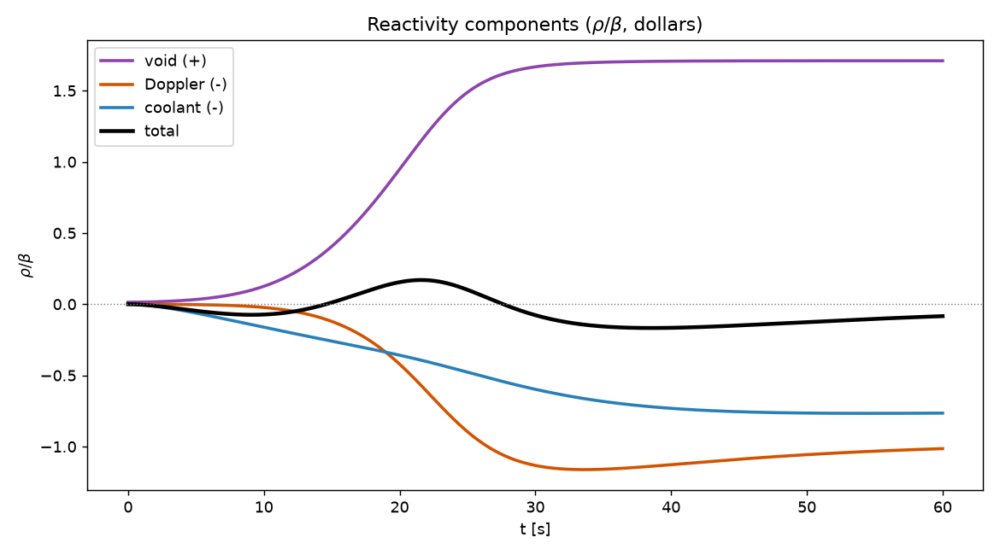
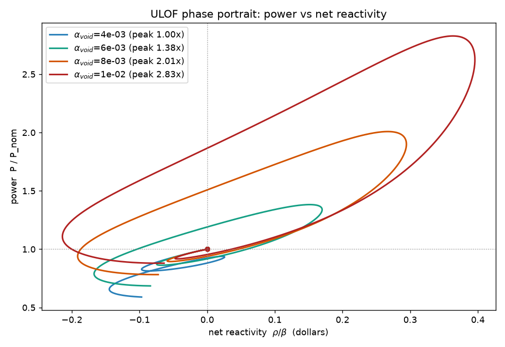
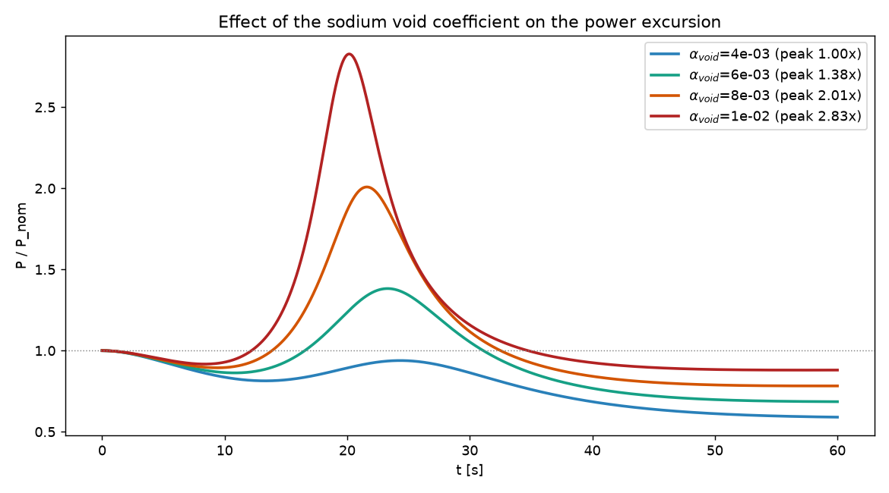
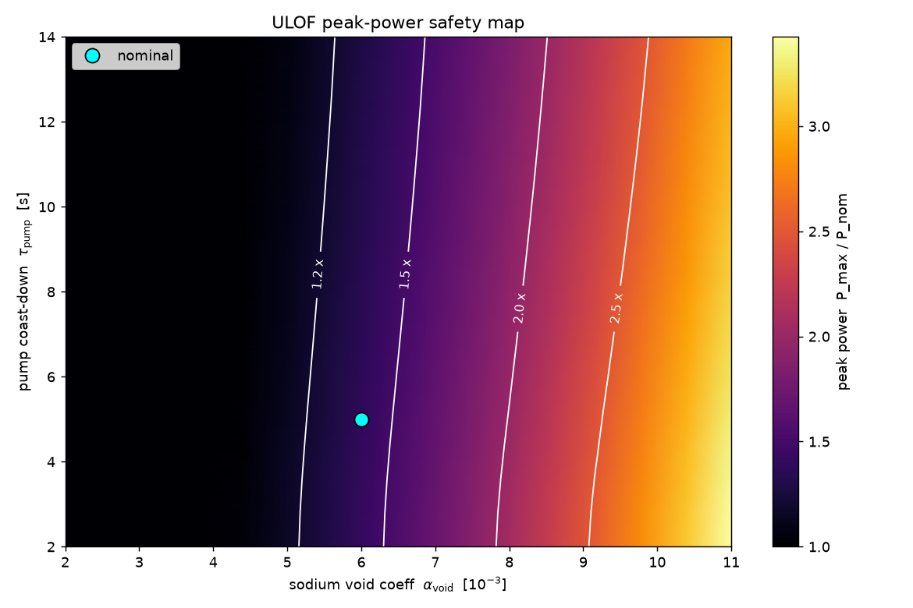

# Physics theory

This document derives and explains the coupled model solved in
`pinn-sfr-transient`: six-group point kinetics, lumped two-node
thermal-hydraulics, and the reactivity-feedback closure that makes the
**Unprotected Loss of Flow (ULOF)** the limiting transient for a sodium-cooled
fast reactor (SFR). Citations in square brackets refer to `docs/references.md`.

State vector throughout:

```math
\mathbf{y}(t) = \big[\,P,\; C_1,\dots,C_6,\; T_f,\; T_c\,\big]^\top .
```

---

## 1. Neutron kinetics — the point kinetics equations (PKE)

### 1.1 From transport to a point model

The full time-dependent neutron behaviour is governed by the Boltzmann transport
equation coupled to the delayed-precursor Bateman equations. Integrating the
spatial and energy dependence against the fundamental flux mode and assuming the
flux *shape* is separable from its *amplitude* yields the **point kinetics
equations** — a reduced-order model that tracks only the scalar amplitude $P(t)$
(proportional to reactor power) and the delayed-neutron precursor populations
$C_i(t)$ [Duderstadt & Hamilton 1976; Hetrick 1971]:

```math
\frac{dP}{dt} = \frac{\rho(t) - \beta}{\Lambda}\,P + \sum_{i=1}^{6}\lambda_i C_i,
\qquad
\frac{dC_i}{dt} = \frac{\beta_i}{\Lambda}\,P - \lambda_i C_i .
```

| Symbol | Meaning | Role |
|---|---|---|
| $P$ | normalised power / neutron amplitude | $P=1$ at nominal |
| $C_i$ | precursor concentration, group $i$ | delayed-neutron memory |
| $\rho(t)$ | reactivity $(k-1)/k$ | the control + feedback input |
| $\beta=\sum_i\beta_i$ | total delayed fraction | "distance" to prompt criticality |
| $\beta_i$ | delayed fraction of group $i$ | source of $C_i$ |
| $\lambda_i$ | precursor decay constant | $1/\lambda_i$ = mean delay |
| $\Lambda$ | prompt neutron generation time | sets the prompt time scale |

### 1.2 Prompt vs delayed, and why $\beta$ matters

Most fission neutrons are *prompt* (emitted in $\sim10^{-14}$ s). A small
fraction $\beta$ appear *delayed*, released over seconds as precursors decay.
Although tiny ($\beta\approx0.0065$ for U-235, smaller for fast Pu-bearing
SFR fuel, $\beta_{\text{eff}}\approx0.0035$), the delayed neutrons dominate the
controllable time scale: with $\rho<\beta$ the reactor is *delayed critical* and
evolves on the $1/\lambda_i$ scale (seconds), tractable for control. When
$\rho\ge\beta$ the reactor is *prompt critical* and power diverges on the
$\Lambda$ scale — catastrophic. Reactivity is therefore often quoted in
**dollars** ($\rho/\beta$), so $\rho/\beta = 1$ is exactly prompt critical.

### 1.3 Stiffness

For a fast reactor $\Lambda\approx5\times10^{-7}$ s, while $1/\lambda_i$ ranges
from $\sim0.3$ s to $\sim80$ s. The PKE thus span time scales separated by
$\sim10^{8}$, making the system **extremely stiff**. Two consequences:

* the steady-state precursor concentrations are large,
  $C_{i,0}=\beta_i/(\Lambda\lambda_i)\sim10^4\text{ to }10^5$ for $P=1$;
* explicit integration is unusable; the reference solver uses an implicit
  Radau/BDF scheme (`src/reference.py`), and the PINN requires the
  non-dimensionalisation of §5 to train at all (see `docs/neural_network.md`).

Stiffness is the documented "failure mode" of naive PINNs on kinetics
[Ji et al. 2021; Krishnapriyan et al. 2021], which motivates the formulation
this project adopts.

---

## 2. Thermal-hydraulics — lumped two-node core

Energy deposited by fissions heats the fuel, which conducts heat to the flowing
sodium coolant, which is carried out of the core. A minimal but faithful
reduced model uses one fuel node $T_f$ and one coolant node $T_c$
[Hetrick 1971; Todreas & Kazimi 2012]:

```math
\frac{dT_f}{dt} = \frac{P_0}{C_f}\,P - \frac{UA}{C_f}\,(T_f - T_c),
\qquad
\frac{dT_c}{dt} = \frac{UA}{C_c}\,(T_f - T_c) - \frac{W_0\,g(t)}{C_c}\,(T_c - T_{in}).
```

* $P_0$ — nominal power scale (deposited in the fuel node).
* $UA$ — fuel→coolant conductance (heat-transfer coefficient × area).
* $C_f, C_c$ — fuel- and coolant-node heat capacities.
* $W_0 = 2\,\dot m_0 c_{p,c}$ — nominal coolant heat-removal coefficient; the
  factor 2 converts the average coolant temperature to an outlet temperature
  $T_{out}=2T_c-T_{in}$ for a node with linear axial profile.
* $T_{in}$ — core inlet (cold-leg) temperature.
* $g(t)$ — normalised mass-flow fraction (§4).

The constants are derived (`src/config.py`) so the nominal steady state is exact:
$P_0 = UA\,(T_{f0}-T_{c0}) = W_0\,(T_{c0}-T_{in})$.

---

## 3. Reactivity feedback — the coupling

Temperature and density changes feed back into reactivity, closing the loop
between §1 and §2:

```math
\rho(t) = \rho_{ext} + \underbrace{\alpha_f\,(T_f-T_{f0})}_{\text{Doppler}}
+ \underbrace{\alpha_c\,(T_c-T_{c0})}_{\text{coolant density}}
+ \underbrace{\alpha_{\text{void}}\,\phi(T_c)}_{\text{sodium void}} .
```

### 3.1 Doppler feedback $\alpha_f<0$

As fuel heats, resonance absorption lines in U-238/Pu-240 broaden
(Doppler broadening), increasing parasitic capture and removing reactivity. It
is **prompt** (acts the instant fuel temperature rises) and **negative** — the
primary inherent safety mechanism of a fast reactor [Waltar et al. 2012].

### 3.2 Coolant density / expansion $\alpha_c<0$

Sodium expansion and structural feedbacks; modelled here as a small negative
coefficient on $T_c$.

### 3.3 Sodium void coefficient $\alpha_{\text{void}}>0$ — the SFR signature

If the coolant boils or voids, two competing effects occur: reduced moderation
(minor in a fast spectrum) and reduced parasitic capture / **spectrum
hardening**, which in a large SFR core gives a **net positive** reactivity
contribution. A *positive* void coefficient is the defining safety concern of
the SFR class: voiding adds reactivity, which raises power, which raises
temperature, which causes more voiding — a potential runaway, opposed only by
the prompt negative Doppler [Waltar et al. 2012]. The interplay of these two
feedbacks is exactly what this model is built to capture.

The reactor is defined to be **exactly critical at nominal conditions**: a small
residual from the smooth void model at $T_{c0}$ is absorbed into $\rho_{ext}$ so
that $\rho(T_{f0},T_{c0})=0$ and the nominal state is a true fixed point
(`SFRParams.__post_init__`). Without this, the $1/\Lambda$ amplification would
turn an un-cancelled $10^{-5}$ into a spurious $\sim10^2$ in $dP/dt$.

---

## 4. The ULOF transient

In an **Unprotected** Loss of Flow, the primary pumps trip but the control/safety
system fails to scram (no rod insertion) — so reactivity feedback is the *only*
thing that can arrest the transient. The pump coast-down is modelled as an
exponential decay to a residual natural-circulation floor:

```math
g(t) = f_{nc} + (1-f_{nc})\,e^{-t/\tau_{\text{pump}}}, \qquad g(0)=1 .
```

Physical narrative produced by the model:

1. Flow drops → the coolant cannot remove the heat → $T_c$ rises.
2. $T_c$ crosses the boiling/void onset → the **positive** void coefficient
   injects reactivity → power rises above nominal.
3. Rising power heats the fuel → the **negative** Doppler feedback grows.
4. Doppler (and coolant feedback) overtake the void contribution → net
   reactivity goes negative → power turns over and settles.

With the default parameters the excursion peaks near $1.38\times$ nominal at
$\sim23$ s and settles to $\sim0.69\times$ — a **bounded, self-limiting**
transient demonstrating the void-vs-Doppler competition.


Decomposing the total reactivity makes the competition explicit: the positive
void term ramps up first and drives the excursion, then the negative Doppler term
overtakes it and turns the power over (the black total crosses back through zero).



Plotting power against net reactivity, parameterised by time, turns each
transient into a loop — flow loss drives reactivity positive (void), power swings
up, fuel heating then pulls it negative (Doppler), and the system spirals back:



### 4.1 Parameter dependence

The size of the excursion is governed almost entirely by the sodium void
coefficient $\alpha_{\text{void}}$. Increasing it raises the peak sharply — until
the prompt negative Doppler can no longer bound the transient:



Sweeping both $\alpha_{\text{void}}$ and the pump coast-down time
$\tau_{\text{pump}}$ gives a peak-power safety map: a steep gradient along
$\alpha_{\text{void}}$ with only a weak $\tau_{\text{pump}}$ tilt. The nominal
design point sits in the benign ($\sim1.4\times$) corner. This is the kind of
*family* of transients the operator-learning extension targets
(see `docs/neural_network.md` §8).



All five figures are regenerated from the model by `uv run pinn-sfr figures`
(`src/pinn_sfr_transient/figures.py`) — never exported by hand.

---

## 5. Void model, non-dimensionalisation, and parameters

### 5.1 Smooth void / boiling onset

A differentiable onset is required for the PINN's automatic differentiation, so
the void fraction uses a logistic ramp rather than a hard threshold:

```math
\phi(T_c) = \sigma\!\left(\frac{T_c - T_{\text{onset}}}{\Delta T_{\text{void}}}\right),
\qquad \sigma(x)=\tfrac12\big(1+\tanh\tfrac{x}{2}\big)\in[0,1).
```

### 5.2 Non-dimensionalisation (used by the PINN)

Define normalised states $p=P$, $c_i=C_i/C_{i,0}$,
$\theta_f=(T_f-T_{in})/(T_{f0}-T_{in})$, $\theta_c=(T_c-T_{in})/(T_{c0}-T_{in})$.
Substituting $C_i=C_{i,0}c_i$ with $C_{i,0}=\beta_i/(\Lambda\lambda_i)$ collapses
the precursor equations to the clean, well-scaled form

```math
\frac{dc_i}{dt} = \lambda_i\,(p - c_i),
```

and multiplying the power equation by $\Lambda$ rescales it to $O(\beta)$:

```math
\Lambda\,\frac{dp}{dt} = (\rho-\beta)\,p + \sum_i \beta_i c_i .
```

This is the key to training a PINN on a system this stiff (see
`docs/neural_network.md` and `tests/test_consistency.py`, which verifies the
normalised residuals equal the physical ODEs to machine precision).

### 5.3 Default parameters

| Group | $\lambda_i$ [1/s] | relative $\beta_i$ |
|---|---|---|
| 1 | 0.0124 | rescaled from the U-235 spectrum |
| 2 | 0.0305 | so that $\sum_i\beta_i=\beta_{\text{eff}}$ |
| 3 | 0.111 | |
| 4 | 0.301 | |
| 5 | 1.14 | |
| 6 | 3.01 | |

$\beta_{\text{eff}}=3.5\times10^{-3}$, $\Lambda=5\times10^{-7}$ s,
$\alpha_f=-2\times10^{-5}$/K, $\alpha_c=-1\times10^{-5}$/K,
$\alpha_{\text{void}}=+6\times10^{-3}$, $T_{f0}=1000$ K, $T_{c0}=700$ K,
$T_{in}=628$ K, $T_{\text{onset}}=820$ K, $\tau_{\text{pump}}=5$ s, $f_{nc}=0.15$.

---

## 6. Validity and caveats

This is a **proof-of-concept** model, not a licensing-grade analysis:

* Units form a consistent *scaled* system; temperatures are physical kelvin but
  power is normalised and heat capacities are scaled to make the nominal steady
  state exact.
* The $820$ K void onset is a **demonstration hot-channel threshold**, not the
  $\sim1156$ K sodium saturation temperature at 1 atm. Swap in a physical onset
  with a more aggressive coast-down for a credible run.
* Feedback coefficients are representative, tuned to exhibit the void-vs-Doppler
  competition while remaining bounded. Real SFR void worths can be several
  dollars and demand spatially-resolved kinetics.
* The lumped two-node TH ignores axial/radial structure, sub-channel effects,
  and two-phase flow dynamics beyond the scalar void surrogate.

These simplifications are deliberate: they isolate the coupled-feedback physics
the PINN must learn while keeping the reference solvable to high accuracy.
